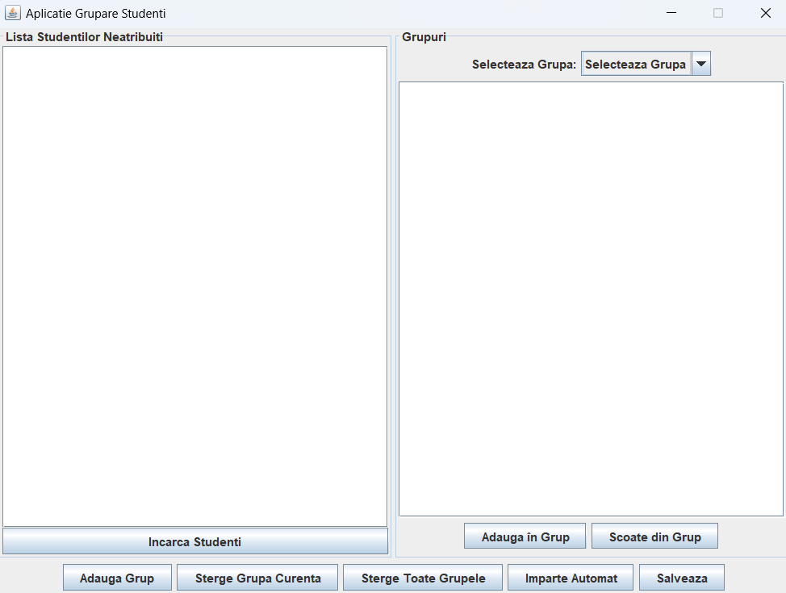
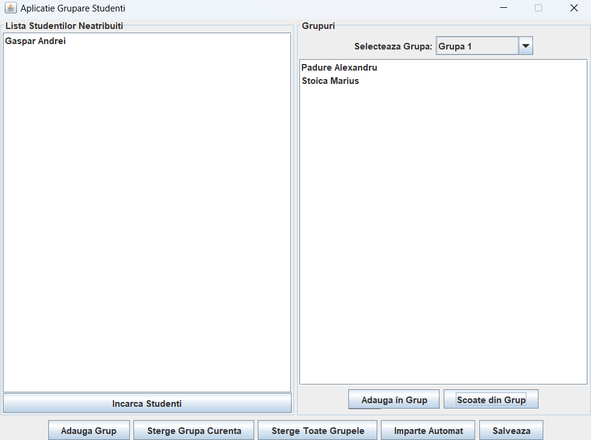

# Student Group Divider UI

This project provides a graphical interface for dividing a list of students into groups. It is designed to simplify the process of grouping students and managing group assignments.

## Features

1. **Load Students from File**  
   - Import a list of students from a text file, where each student's name is on a separate line.

2. **Save Groups to CSV**  
   - Export groups to CSV files, including the group number and the students in each group.

3. **Automatic Group Division**  
   - Automatically divide students into groups based on the number of groups specified by the user.

4. **Manual Group Management**  
   - View groups and their students.  
   - Move unassigned students or reassign students between groups using an intuitive interface with combo-boxes, lists, and buttons.

5. **Create New Groups**  
   - Easily add and manage new groups through the application's interface.

## Application Details

The application implements the following requirements:

1. **Student List Input**: Load a list of students from a text file, where each student's name is on a separate line.
2. **Group Export**: Save groups to CSV files, each containing the group number and the list of students in that group.
3. **Automatic Grouping**: Divide students into groups automatically, allowing the user to specify the desired number of groups.
4. **Manual Group Management**:
   - View groups and their assigned students.
   - Move unassigned students or reassign students between groups using a user-friendly interface with combo-boxes, lists, and buttons.
5. **New Group Creation**: Provide an interface for creating and managing new groups dynamically.
6. **Delete Groups**: Provide buttons to delete groups.

## How to Use

1. **Load Students**: Use the file upload functionality to import a list of students from a text file.
2. **Divide Students**: Specify the number of groups, and the application will automatically divide the students.
3. **View and Edit Groups**: View the generated groups and make manual adjustments if necessary.
4. **Export Groups**: Save the groups to a CSV file for further use or sharing.

## Screenshots




## Requirements
- Java 11+
- Libraries: 
  - `java swing` for GUI
  - `apache.commons.csv` for file handling

## Installation

1. Clone the repository:
   ```bash
   git clone https://github.com/yourusername/student-group-divider-ui.git
